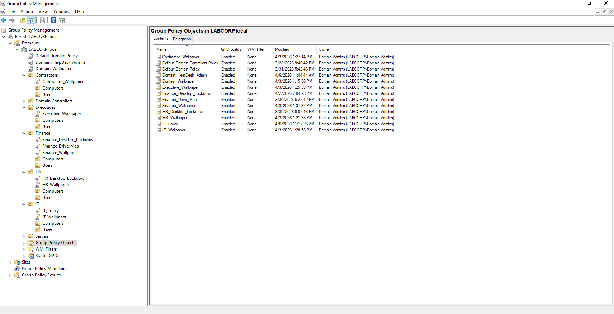
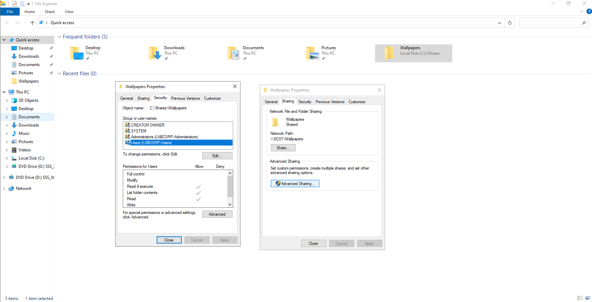

# LABCORP.local - Active Directory Home Lab

**A fully functional Active Directory environment built from scratch in VMware to simulate enterprise IT infrastructure, administration, and troubleshooting.**

Built by [Nathan Mathis](https://www.linkedin.com/in/n-mathis/) | IT Professional | 14+ Years Enterprise IT Experience

---

## Why I Built This

After 14 years supporting enterprise environments at Dell Technologies/Boeing, I wanted a personal lab where I could replicate the infrastructure I've worked with professionally - and push deeper into areas like Group Policy design, OU delegation, and access control. This lab serves as both a skills platform and a reference environment for continued learning in systems administration and security.

---

## Lab Environment

| Component | Details |
|-----------|---------|
| **Host Machine** | AMD Ryzen 7 7800X3D, 32GB RAM, NVMe Storage |
| **Hypervisor** | VMware Workstation |
| **Domain Controller** | DC01 - Windows Server 2022 |
| **Domain** | LABCORP.local |
| **Client 1** | PC01 - Windows 10 Pro (domain-joined) |
| **Client 2** | PC02 - Windows 10 Pro (domain-joined) |
| **Additional VMs** | Kali Linux, Ubuntu |

---

## What I Built

### Active Directory Domain Services (AD DS)

- Promoted DC01 to Domain Controller for LABCORP.local
- Configured DNS and DHCP services
- Joined multiple Windows 10 workstations to the domain

### Organizational Unit (OU) Structure

Designed a structured OU hierarchy to mirror a real enterprise environment, enabling targeted GPO application and delegated administration.

### Group Policy Objects (GPOs)

Created and linked GPOs to enforce security baselines, user environment settings, and administrative controls across the domain.

### Delegated Administration

Configured role-based delegation so that specific accounts have limited administrative permissions within their designated OUs - mimicking real-world tiered support models.

- Help Desk accounts: password resets and account unlocks within Corporate OU
- IT Admin accounts: full object control within Workstations OU
- Separation of duty between Domain Admin and delegated roles

### Shared Folders and Permissions

Set up network shares with NTFS and share-level permissions, organized by department. Configured access using security groups to follow the principle of least privilege.

### Client Deployment

- Joined PC01 and PC02 to the LABCORP.local domain
- Verified GPO application on client machines using `gpresult /r`
- Tested user login across multiple OUs to confirm policy inheritance and filtering

---

## Key Skills Demonstrated

- Active Directory Domain Services (AD DS) deployment and management
- DNS and DHCP configuration
- Group Policy design, linking, and troubleshooting
- OU structure planning for enterprise environments
- NTFS/share permissions and access control
- Role-based delegated administration
- Domain join and client configuration
- VMware virtualization and multi-VM networking
- PowerShell for AD administration

---

## Scripts

The [`/scripts`](/scripts) folder contains PowerShell scripts used to build and manage this environment.

---

## What's Next

- [ ] Integrate with DFIR lab environment for incident response practice
- [ ] Add a second domain controller for replication and fault tolerance
- [ ] Implement certificate services (AD CS)
- [ ] Build out a SIEM integration for log monitoring
- [ ] Automate full lab deployment via PowerShell

---

## About Me

IT professional with 14+ years of enterprise experience in IMACD (Install, Move, Add, Change, Dispose) service delivery at Dell Technologies supporting Boeing facilities. CompTIA A+ certified, currently pursuing Network+ (N10-009), with a long-term career path toward Digital Forensics and Incident Response (DFIR).

- [LinkedIn](https://www.linkedin.com/in/n-mathis/)
- [Resume available upon request]
